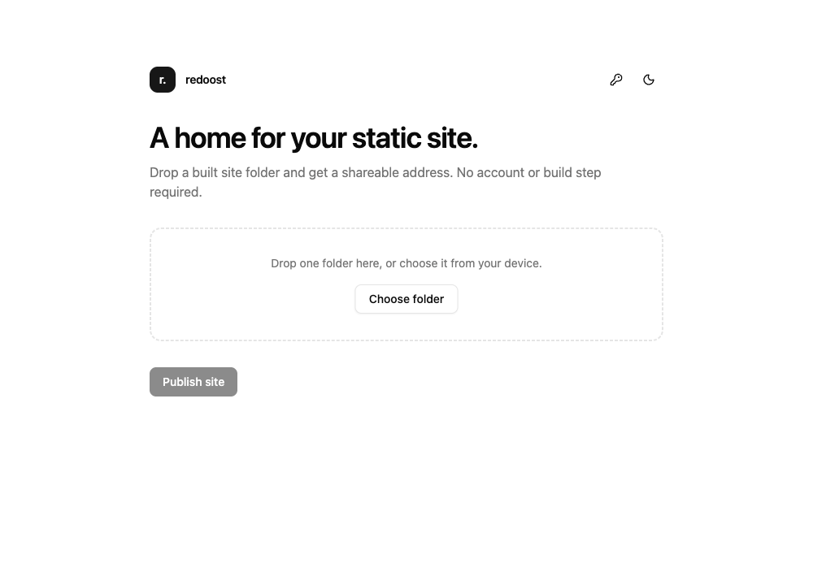
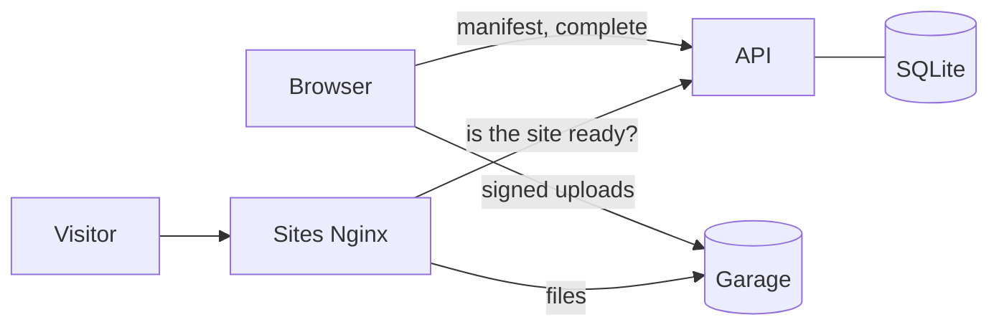

# redoost

A self-hosted alternative to Vercel Drop and Cloudflare Pages direct uploads.
Drop a folder with a built static site and get a shareable address, with no
account and no build step.

**[Try it at redoost.whyredfire.dev](https://redoost.whyredfire.dev)**



## Features

- **Drop a folder, get a URL.** Each site is published at
  `https://<slug>.<sites domain>`, for example `brave-otter-1a2b`.
- **Uploads go straight to storage.** The browser uploads each file to S3
  (Garage) with its own signed policy, bound to the file's path, size, content
  type, and SHA-256 checksum. The API never handles file contents.
- **Fast and resumable.** Up to 32 files upload in parallel with retries. If an
  upload is interrupted, selecting the same folder again resumes it.
- **Single-page apps just work.** Sites without a top-level `404.html` serve
  `index.html` for unknown pages; sites with one get their own 404 page.
- **Manage your sites.** Sites published from a browser are listed with their
  size and date, and can be deleted. Copy your token to manage them from
  another device.
- **Sensible limits.** 10 MiB per file, 50 MiB and 500 files per site, all
  configurable.

## How it works



1. The dashboard hashes the folder's files and sends a manifest to the API,
   which returns one signed upload policy per file.
2. The browser uploads the files directly to the bucket; Garage checks each
   checksum.
3. The API confirms every file arrived and marks the site ready.
4. Nginx serves `<slug>.<sites domain>` from Garage's website endpoint, after
   checking with the API (cached briefly) that the site exists.

Built with FastAPI, SQLModel, and Alembic on SQLite; React, Tailwind, and
shadcn/ui on Bun; [Garage](https://garagehq.deuxfleurs.fr) for storage; and
Nginx for serving sites.

## Self-hosting on Kubernetes

The Helm chart in [`chart/`](chart) runs the API, the frontend, and the sites
Nginx, routed with Gateway API HTTPRoutes. Garage isn't part of the chart; it
expects:

- a bucket and a key with owner permission on it (the setup Job enables the
  bucket's website endpoint and CORS),
- Garage's website endpoint (`[s3_web]`, port 3902) for `s3.websiteUpstream`,
- a public route to Garage's S3 API for `s3.publicEndpoint`, since browsers
  upload to it directly,
- a Gateway listener and wildcard certificate covering `*.<sites host>`.

```yaml
# values.yaml
appOrigin: https://redoost.example.com
sitesOrigin: https://sites.example.com
httpRoute:
  app:
    parentRefs:
      - name: gateway
        namespace: gateway
        sectionName: https
  sites:
    parentRefs:
      - name: gateway
        namespace: gateway
        sectionName: https-sites
s3:
  endpoint: http://garage.garage.svc.cluster.local:3900
  publicEndpoint: https://s3.example.com
  websiteUpstream: garage.garage.svc.cluster.local:3902
  existingSecret: redoost-s3
```

```sh
helm install redoost ./chart -f values.yaml
```

Pushes that change the backend or frontend build both images for amd64 and
arm64 and publish them to `ghcr.io/whyredfire/redoost-api` and
`redoost-frontend`, tagged `sha-<commit>` and `latest`. The workflow then
commits the new `sha-` tag to `chart/values.yaml`, so anything deploying the
chart from `main` rolls out the new images.

See [`chart/values.yaml`](chart/values.yaml) for all settings. The API runs as a
single replica with the `Recreate` strategy, since SQLite lives on one volume.

## Local development

Everything runs in Docker Compose:

```sh
cp .env.example .env
docker compose up --build --wait
docker compose watch
```

`docker compose watch` syncs source changes into the containers, where the API
and frontend reload in place; lockfile changes rebuild the image. The
`Dockerfile.dev` images are for development only; `backend/Dockerfile` and
`frontend/Dockerfile` build the production images.

Only two ports are published. The `gateway` service stands in for the cluster's
ingress and routes by host:

| URL | Routes to |
| --- | --- |
| <http://localhost:8081> | Dashboard, with `/api/` going to the API |
| `http://<slug>.sites.localhost:8081` | Published sites |
| `http://s3.localhost:8081` | Garage's S3 API, for browser uploads |
| <http://localhost:8080> | Garage UI (log in with `GARAGE_ADMIN_TOKEN`) |

On startup, the one-off `init` service enables the bucket's website endpoint
and CORS, and `migrate` applies database migrations. See
[`backend/README.md`](backend/README.md) and
[`frontend/README.md`](frontend/README.md) for the API, migrations, and checks.

## Configuration

The API reads `REDOOST_*` environment variables; the chart sets them from its
values.

| Variable | Default | Description |
| --- | --- | --- |
| `REDOOST_APP_ORIGIN` | | Dashboard origin, allowed to upload to the bucket |
| `REDOOST_LOG_LEVEL` | | `INFO` or `VERBOSE` |
| `REDOOST_DATABASE_URL` | `sqlite+aiosqlite:///./redoost.db` | Async SQLAlchemy database URL |
| `REDOOST_S3_ENDPOINT` | | S3 endpoint used by the API |
| `REDOOST_S3_PUBLIC_ENDPOINT` | | S3 endpoint used by browsers for uploads |
| `REDOOST_S3_REGION` | | Region used for signing |
| `REDOOST_S3_BUCKET` | | Bucket that stores the sites |
| `REDOOST_S3_ACCESS_KEY_ID` | | S3 access key ID |
| `REDOOST_S3_SECRET_ACCESS_KEY` | | S3 secret access key |
| `REDOOST_MAX_FILE_SIZE` | `10MiB` | Largest allowed file |
| `REDOOST_MAX_DEPLOYMENT_SIZE` | `50MiB` | Largest allowed site |
| `REDOOST_MAX_DEPLOYMENT_FILES` | `500` | Most files allowed in a site |
| `REDOOST_UPLOAD_WINDOW` | `PT1H` | How long upload policies stay valid (at most 24 hours) |

In Compose, the sites Nginx also reads `REDOOST_SITES_DOMAIN`,
`REDOOST_API_UPSTREAM`, and `REDOOST_S3_WEBSITE_UPSTREAM`, and the dev server
reads `REDOOST_SITES_ORIGIN` for site links.

## License

[MIT](LICENSE)
